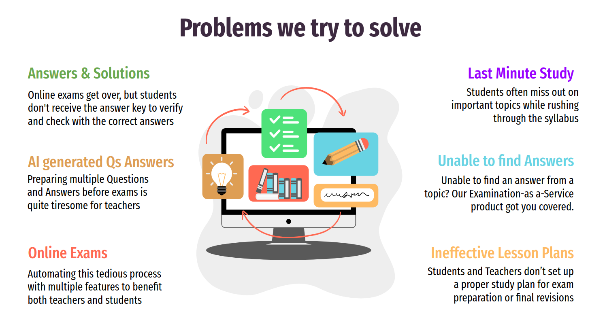
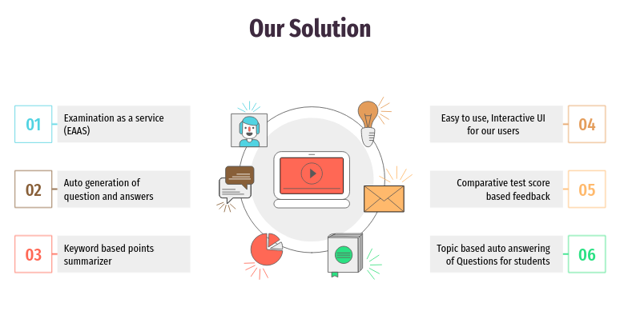
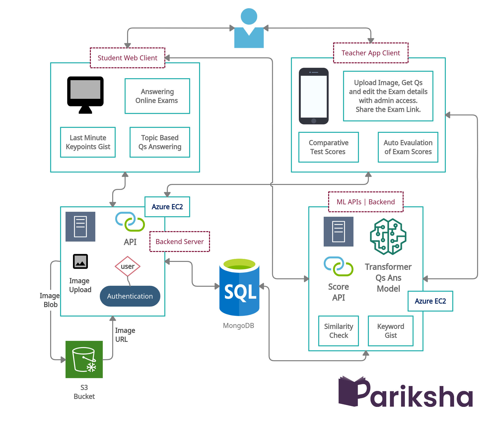
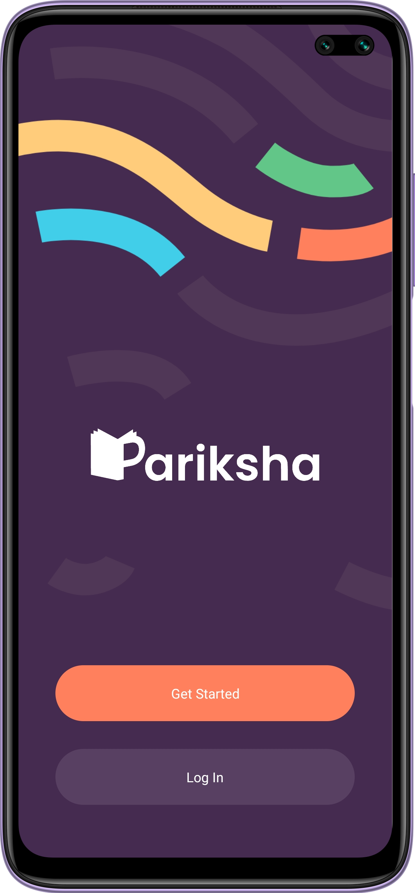
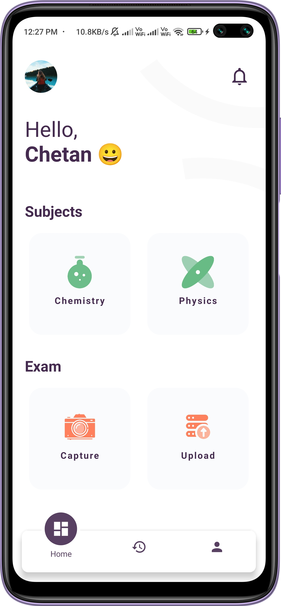
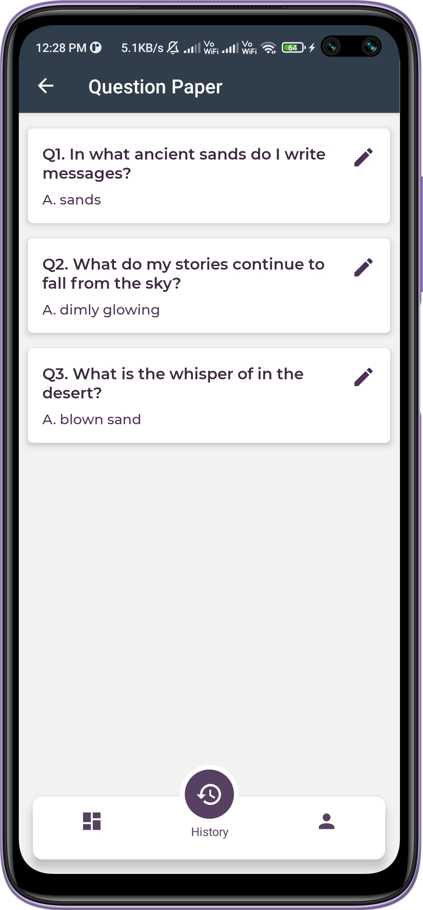
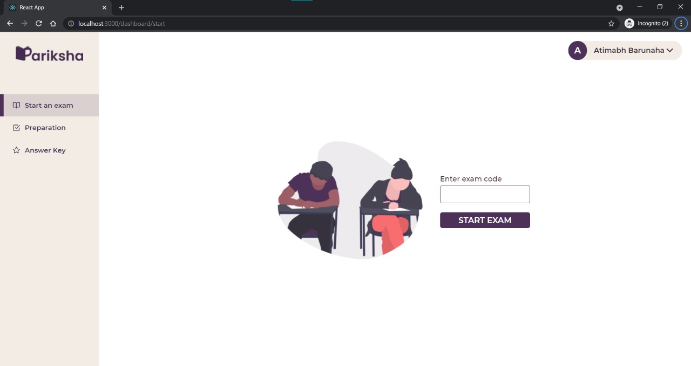

<div align="center"> 
  <p align='center'> 
   <br><br>
   
   <br><br>
   <br>
   
    <br>   
  </p>
  <hr>
  
  <br><br>
 </div>
 


 <div align="center"> 
    <p>
    </p>
    
  <br><br>
 </div>

<div align="center"> 
    <p>
    </p>
    
  <br><br>
 </div>


<div align="center"> 
  <br><br>
  <p float="left">
    
     
    
  </p><br>
   <br>
   
</div>
<br>

<div align="center"> 
  <br>
</div>
<br>


 ```
 
 - Python(3.9.6): Poetry for python dependency management
 - Node.js
 - React js
 - React Native
  
 ```
 <br>
 
 <div align="center"> 
   
</div><br>

 ```
 Fork The Repository ✅
 
 $ git clone https://github.com/<username>/Pariksha.git   
```

  ```
 $ cd Pariksha
 ```

#### Start the Python ML backend 🚀 :

   ```
   !! Add.env file with the Database credentials.
   !! MONGO_URL= ''' MongoDB connection URL'''
   
   curl -sSL https://raw.githubusercontent.com/python-poetry/poetry/master/get-poetry.py | python -
   cd ML-server
   bash init.sh
   poetry install
   bash run.sh
   ```
  

#### Start the Backend Server 🗃 :

  ```
  npm install 
  npm install -g nodemon
  nodemon app
  ```

#### Start the Frontend Admin 🖥️ :
  
  ```
  npm install
  npm start
  ```

#### Start the Native App 📱 :

  ```
  npm install
  npx react-native run-android
  ```

<br><br>

<div align="center"> 
   
</div>
  <br>
  
  #### Python Backend :
  
  ```
  Python 3.9+
  - Transformer
  - Pytorch
  - nltk
  - Spacy
  - Motor
  - Tesseract
  - Poetry
  - FastAPI
  - Uvicorn
  
  Database
  - MongoDB
  
  Deployment
  - Azure
  ```
  
  <div>
   <h3>API Documentation:</h3>

  <a href="https://pariksha.imswarnabha.in/docs#/"> https://pariksha.imswarnabha.in/docs# </a><br>
  </div>
  
  #### Admin | Frontend
  
  ```
  - React JS
  ```
  
  #### Server | Backend
  
  ```
  - Node JS
  - Express
    
    Deployment
    - Azure    
    
   ```
  <div>

  <h3>API Documentation:</h3>

  <a href="https://api.cp99says.in/"> https://api.cp99says.in/ </a><br>

  </div>


  
  #### Native | Android
  
  ```
  - React Native
  ```
  <br>

<div align="center"> 
   
</div>
  <br>

    
<div align="center"> 
  <table>
<tr align="center">
 <td>

Atimabh Barunaha

<p align="center">

</p>
<p align="center">
<a href = "https://github.com/Atimabh"></a>
<a href = "https://www.linkedin.com/in/barunaha/">

</a>
</p>
 <strong>Frontend | UI-UX<strong>
</td>
<td>
  
Chetan Pareek

<p align="center">

</p>
<p align="center">
<a href = "https://github.com/cp99says"></a>
<a href = "https://www.linkedin.com/in/cp99says/">

</a>
</p>
  <strong>Backend Developer<strong>
</td>
 <td>
    
Ram Prakash Reddy

<p align="center">

</p>
<p align="center">
<a href = "https://github.com/ramprakashreddy"></a>
<a href = "https://www.linkedin.com/in/ram1612/">

</a>
</p>
    <strong>App Developer<strong>
</td>

<td>
  
Swarnabha Das

<p align="center">

</p>
<p align="center">
<a href = "https://github.com/sd2001"></a>
<a href = "https://www.linkedin.com/in/swarnabha-das-2001official/">

</a>
</p>
  <strong>ML | Backend<strong>
</td>
  
  </table>
</tr>
</div>
  <br>
  
  
 <!-- END -->

<div align="center">
 <p>
 <br>
   <br>
   <br><strong><Repo-Name></strong>This Repository is available under MIT License, read the LICENSE file for more info
  <p>
 </div>
   
 <div align="center">
  
 </div>
